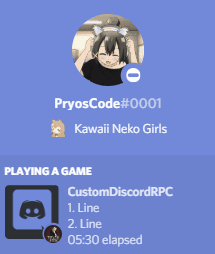

[version]: https://img.shields.io/github/downloads/PryosCode/CustomDiscordRPC/total?label=Downloads
[download]: https://github.com/PryosCode/CustomDiscordRPC/releases
[discord-invite]: https://discord.gg/bF2GRHq
[license]: https://github.com/PryosCode/CustomDiscordRPC/blob/master/LICENSE
[discord-shield]: https://discordapp.com/api/guilds/350302354639290379/widget.png
[license-shield]: https://img.shields.io/github/license/PryosCode/CustomDiscordRPC?label=License
[ ![version][] ][download]
[ ![license-shield][] ][license]
[ ![discord-shield][] ][discord-invite]

# CustomDiscordRPC



Customisable Discord Rich Presence Client written in Java for Windows.

## Getting Started

You have to create your own [Discord Application](https://discordapp.com/developers/applications) and you can upload some assets if you want to use them later.
To run this application you will have to have [Java](https://www.java.com/) installed.

## Installation

The latest version can be found on [GitHub](https://github.com/PryosCode/CustomDiscordRPC/releases).
You can start the `CustomDiscordRPC.exe` or you can install the `Setup-CustomDiscordRPC.exe`.
If the application is running you can find a system tray and if you click on it you will find an option called `Config`.
This will open the `config.json` and you will have to set the `ClientID`.
In this file you can configure every perspective of this application.

## Dependencies

If you want to expand this application, you will have to install:

* [JTattoo](http://www.jtattoo.net/)
* [Gson](https://github.com/google/gson)
* [Discord-RPC](https://github.com/MinnDevelopment/java-discord-rpc)

### Maven

```xml
<!-- https://mvnrepository.com/artifact/com.jtattoo/JTattoo -->
<dependency>
    <groupId>com.jtattoo</groupId>
    <artifactId>JTattoo</artifactId>
    <version>1.6.12</version>
</dependency>

<!-- https://mvnrepository.com/artifact/com.google.code.gson/gson -->
<dependency>
    <groupId>com.google.code.gson</groupId>
    <artifactId>gson</artifactId>
    <version>2.8.6</version>
</dependency>

<!-- https://mvnrepository.com/artifact/club.minnced/java-discord-rpc -->
<dependency>
    <groupId>club.minnced</groupId>
    <artifactId>java-discord-rpc</artifactId>
    <version>2.0.1</version>
</dependency>
```

## License

This project is licensed under the Apache License 2.0 - see the [LICENSE.md](https://github.com/PryosCode/CustomDiscordRPC/blob/master/LICENSE) file for details.
