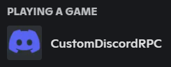
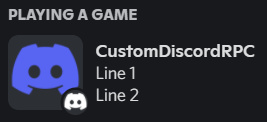
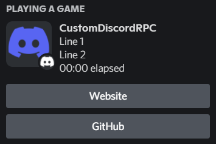

<p align="center">
    <a href="https://github.com/sotasan/customdiscordrpc/tags"></a>
    <a href="https://github.com/sotasan/customdiscordrpc/actions/workflows/build.yml"></a>
    <a href="LICENSE"></a>
</p>

<h1><a href="CustomDiscordRPC/Assets/Icon.png"></a> CustomDiscordRPC</h1>

Customizable Discord Rich Presence Client for Windows.

## Getting Started

You have to create your own [Discord Application](https://discord.com/developers/applications).
Make sure to copy the `Application ID`.
If you want to use images, you can upload them under `Rich Presence Assets`.

## Installation

You can find the latest binary under [Releases](https://github.com/sotasan/customdiscordrpc/releases).

## Configuration 

If the application is running you can find a notification icon in the system tray at the bottom right of your screen.
If you right click on it you will find an option called `Config`.
This will open the config file in notepad.

## Examples

<table><tr><td>

```ini
ApplicationID=638034914398175233
```

</td><td>

<a href="CustomDiscordRPC/Assets/Minimal.png"></a>

</td></tr><tr><td>

```ini
ApplicationID=638034914398175233
Details=Line 1
State=Line 2
LargeImageKey=discord-color
LargeImageText=CustomDiscordRPC
SmallImageKey=discord-white
SmallImageText=Sōta
```

</td><td>

<a href="CustomDiscordRPC/Assets/Normal.png"></a>

</td></tr><tr><td>

```ini
ApplicationID=638034914398175233
Details=Line 1
State=Line 2
Timestamp=true
LargeImageKey=discord-color
LargeImageText=CustomDiscordRPC
SmallImageKey=discord-white
SmallImageText=Sōta
Button1Label=Website
Button1Url=https://sotasan.com
Button2Label=GitHub
Button2Url=https://github.com/sotasan/customdiscordrpc
```

</td><td>

<a href="CustomDiscordRPC/Assets/Extended.png"></a>

</td></tr></table>

## License

[BSD 3-Clause](LICENSE)